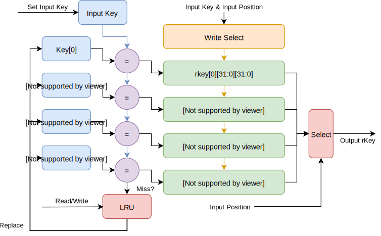
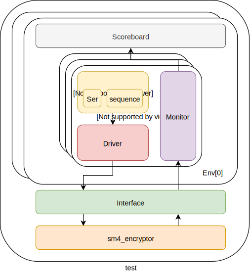
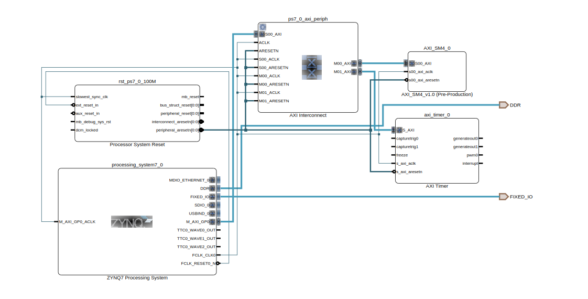
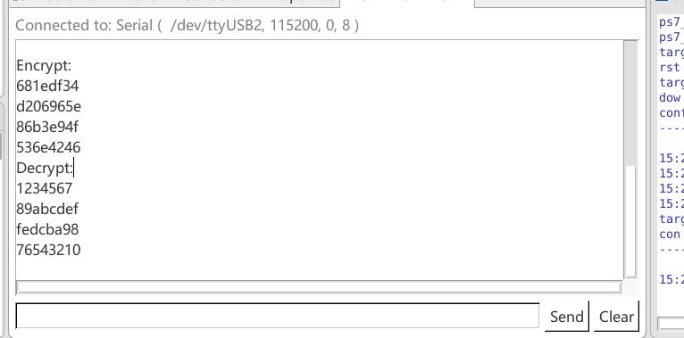
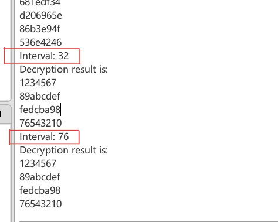
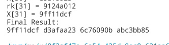
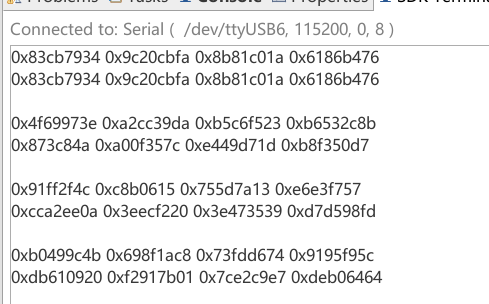

<style>
    h1{
        text-align:center
    }
    h2 {
        text-align:center
    }
    h3{
        text-align:center;
    }
    li {
        font-size: 18px;
    }
    p{
        font-size: 18px;
    }
    @media print {
        @page {
            margin: 0.75in
        }
    }
</style>
<section>

<h1>“复微杯” 2019上海大学生<br>电子设计大赛</h1>

## 数字赛道_安全
<br>
<p style="text-align:center; font-size: 35px"> SM4加密算法的数字电路实现</p>
<br>
<br>
<div style="text-align:center"></div>
<br>
<br>
<br>
<br>
<div style="text-align:center;font-size: 20px">
    学校（院）： 复旦大学微电子学院&emsp;
    <br>
    专业： 微电子科学与工程&emsp;&emsp;&emsp;&emsp;&emsp;
    <br>
    队伍名称：心情熊&emsp;&emsp;&emsp;&emsp;&emsp;&emsp;&emsp;&emsp;
    <br>
    队伍编号：&emsp;&emsp;&emsp;&emsp;&emsp;&emsp;&emsp;&emsp;&emsp;&emsp;&emsp;
    <br>
    参赛队员：秦心宇&emsp;熊亚&emsp;林山青&emsp;
    <br>
    指导老师：&emsp;&emsp;&emsp;&emsp;&emsp;&emsp;&emsp;&emsp;&emsp;&emsp;&emsp;
    <br>
    完成日期：2019-09-30&emsp;&emsp;&emsp;&emsp;&emsp;&emsp;
</div>
<p style="page-break-before: always">
</section>
<section>
<h3>参赛须知与承诺</h3>
<ol>
<li>参赛者必须保证参赛作品为首次参赛的原创作品，参赛作品不存在权利争议或侵犯第三方知识产权的行为，违反者自行承担相应责任。</li>
<li>参赛作品有下列情形，主办单位将取消该队伍的参赛资格或追回原授予的荣誉及奖励：经人检举或告发为他人代劳或违反本竞赛相关规定，有具体事实者并经查证属实者；经人检举或告发，涉及著作权、专利权等侵害，且侵权行为一旦经法院判决属实。</li>
<li>参赛作品的专利权、著作权等知识产权均归属该参赛队伍所有，但主办单位享有以原作者名义发表该项作品的权利，参赛队伍需全程参与由主办单位所举办的学术及推广教育活动。</li>
<li>参加队伍应尊重大赛评审委员会的决议，除非能具体证明其他作品违反本办法相 关规定，不得有其他异议。</li>
<li>大赛阶段缴交所有文件将不退回，请参赛队伍自行备份。</li>
</ol>
<div style="text-align: right;">
承诺人： （请全体团队成员签名） <br>
秦心宇&emsp;熊&emsp;亚&emsp;林山青&emsp;&emsp;
<br>
2019年09月30日
</div>
<p style="page-break-before: always">
</section>

### 摘要

SM4作为国家规定的加密算法，在无线局域网的领域中取得了广泛的应用。但在许多嵌入式软件中，SM4是通过通用处理器执行代码实现的。为了提高加密效率，释放通用处理器的负载，我们基于安全性，面积和性能三方面的权衡，设计了SM4加密/解密的专用加速器。

相对于传统的设计，我们的设计分别在面积， 安全性和性能三方面进行了优化。

面积上，我们抛弃了传统查表的方法。通过自行推导S盒的表达式，我们使用纯组合逻辑实现了S盒。经过Design Compiler综合后，在FreePDK 45nm的工艺下，纯组合逻辑相比查找表缩小了40%的面积。

安全性上，我们设计了动态随机掩码，并参考了AES加密方法中的旋转Rotating SBox Masking算法，设计了经过修正后的RSM算法。修正后的算法以与查找表相同面积的代价换取了抵抗SCA攻击的能力。

性能上，我们借鉴了硬件路由器中通常使用一个Cache维护路由表的设计，在加速器中加入了一个用于存储轮密钥的Cache. 当加速器使用相同的密钥进行加密/解密时，就不需要反复求解密钥产生的轮密钥，因而可以提高效率。

为了使得加速器具有更好的通用性，我们将其包装成了AXI4-Lite总线，并以Xilinx Zynq 7000系列的FPGA作为测试平台评估其性能。我们还给出了UVM测试平台的方案，并期望在后续的过程中继续实现。

**关键字：SM4加密算法 S盒 侧信道攻击 能量分析攻击 加密加速器**

<p style="page-break-before: always">

### 团队介绍

“心情熊”团队共有三位2016级本科生组成，均来自复旦大学微电子学院。

秦心宇：负责SBox优化与UVM平台搭建
熊&emsp;亚：负责SCA防范的硬件设计与硬件优化
林山青：负责硬件的实现与FPGA平台的测试

### 目录结构

下表列出了整个项目的目录结构和说明：

目录名|说明
-|-|
dc| Design Compiler 报告文件
doc|文档
driver|适用于嵌入式处理器的AXI总线和C代码驱动程序
fpga|封装好的适用于Xilinx的IP核
include|C/SystemVerilog头文件
rtl|SystemVerilog设计文件
script|实用脚本
src|C++源程序，用于算法验证
testing|适用于Verilator的C++ Testbench文件
uvm|适用于UVM平台搭建的文件，目前只有一个interface.

dc目录下主要为Design Compiler的综合报告，其主要文件有：

文件名|说明
-|-
sbox|直接使用组合逻辑的SBox的DC综合报告
sbox_memory|使用查找表的SBox的DC综合报告
top|顶层模块的DC综合报告

driver目录下主要是IP核和驱动程序，其主要的文件有：

文件名|说明
-|-
AXI_SM4_v1_0_S00_AXI.sv|Vivado产生的AXI接口顶层模块
AXI_SM4_v1_0.sv|Vivado产生的IP核的顶层模块
sm4_driver.c|IP核加速器的驱动源程序，包括加密，ECB和CBC分组加密实现
sm4_driver.h|IP核加速器的驱动源程序的头文件

include目录下主要的文件有：

文件名|说明
-|-
sm4_encryptor_pkg.svh|RTL设计中常量的定义
sm4_encryptor.hpp|SM4算法验证的C++头文件

rtl目录下主要为RTL电路设计，的文件有：

文件名|说明
-|-
key_cache.sv|Cache设计文件
lru_recorder.sv|LRU状态机设计文件
priority_encoder.sv|4bit优先编码器的设计文件
random_mask.sv|32位LFSR随机数产生器设计文件
roll_shifter.sv|32位循环移位模块设计文件
<span>sbox.sv</span>|Sbox设计文件
sm4_encryptor.sv|SM4加速器的顶层文件
turn_transform.sv|执行一次轮变换的组合逻辑的文件
xor_tree.sv|异或树设计文件

script目录下的主要文件有：

文件名|说明
-|-
<span>sbox.py</span>|用于产生SBox查找表的Python脚本

src目录下主要为C++源代码文件，其主要文件有：

文件名|说明
-|-
lfsr.cpp|用于验证LFSR周期的C++设计文件
sm4.cpp|用于验证SM4顶层算法的C++文件

testing目录下的主要文件都是用于Verilator验证器的Testbench, 有：

文件名|说明
-|-
Makefile|用于模块验证Make文件
sm4_box.cpp|用于验证SBox的TB
sm4_encryptor.cpp|用于验证顶层的TB
turn_transform.cpp|用于验证轮变换模块的TB

uvm目录是为测试硬件设计搭建的验证平台，包含两个子文件夹：uvm/uvm_lib中为各种库文件，包括必要的宏定义和基类；uvm/uvm_testing中为uvm组件，主要文件有：

文件名|说明
-|-
sm4_check_transaction.sv|定义的数据封装
sm4_crypt_transaction.sv|定义的数据封装
sm4_driver.sv|Driver类，驱动DUT输入
sm4_encryptor_wrapper.sv|经Interface封装后的DUT顶层模块
sm4_env.sv|unv_test_top的枝，构成uvm主要环境
sm4_monitor.sv|Monitor类，监控DUT输出
sm4_reference.sv|调用DPI-C产生参考输出
sm4_scoreboard.sv|比较DUT输出和参考输出，验证设计的正确性
sm4_sequencer.sv|将测试向量驱动到Driver上
sm4_test_top.sv|验证平台的顶层模块，产生uvm_test_top根节点
sm4_test.sv|测试用例的封装
<span>testcase.sv</span>|生成测试向量
uvm_wrapper.cpp|DUT功能的软件实现，用于产生参考输出


### 方案介绍


#### 抵抗SCA攻击

典型的SCA包括时间分析攻击、电磁辐射攻击、功耗分析攻击等，其中差分功耗攻击对加密芯片的安全性威胁最大，其工作的具体流程如下：

* 选择功耗分析攻击的作用点，通常是算法运行过程中的一个或多个中间值。  
* 实际功耗采集  
* 计算假定的中间结果  
* 将假定的中间结果转换为功耗数据值  
* 理论功耗数据值与实际功耗数据值进行比较  

由上述可见，抵抗SCA中DPA攻击的方案主要分为两方面：  
1. 扰乱功耗信息的获取，在功耗采集过程中制造噪音，或使功耗曲线在时域上无法对齐  
2. 在算法级减少或消除功耗信息与密钥之间的关联性    

在我们的设计中，采取了第二种方法，即通过掩码技术对运行过程中产生的中间值进行随机化操作。为了抵抗高阶的DPA攻击，我们采用了修正RSM方案（Rotating S-Box Masking）。其具体流程如下：

1. 每次加密前生成一个用于掩码的随机数$M_0$。这个随机数可以来自于AXI4-Lite总线的设置，也可以来自其他随机数产生器模块。
2. 执行S盒替换。S盒为我们修正的版本，其满足：
$$
    \text{SBox}'(x \oplus M_0) = \text{SBox}(x) \oplus M_1
$$

其中M1为SBox输出的一个修正参数。对于这个参数具体的由来，可以参考后续SBox的硬件说明部分。

3. 进行$L$变换，可有结果T：

$$
    T = L[\text{SBox}'(x \oplus M_0)] = L[\text{SBox}(x)] \oplus L[M_1]
$$

由于$L[M_1]$一共有5项，我们将其拆分为：

$$
    P = M_1 \oplus M_1 <<< 10 \oplus M_1 <<< 24 \oplus M_1 <<< 18 \\
    Q = M_1 <<< 2 
$$

其中$Q$会与最终的结果异或在一起。我们令$R$为当前轮变换的结果，可有：

$$
    R = L[\text{SBox}(x)] \oplus Q = T \oplus P
$$


而$P$作为下一次迭代的Mask继续使用，即下一轮迭代开始时，执行的S盒替换为：
$$
   \text{SBox}'(R) = \text{SBox}'(T \oplus P) = \text{SBox}(x) \oplus M_2
$$

由此进行32此迭代后，最终在Reverse阶段将$P$异或到最后一项中，即完成了一轮加密。可知加密过程中SBox没有直接出现加密的明文/密文，因而具有较高的安全性。

我们以一些随机的测试为例，发现$P$的周期都大于32,因而可以认为这种修正的RSM算法是一种比较安全的算法。

同时，在进行第二轮加密时，128位的输入$[X_4, X_3， X_2, X_1]$中的$X_4$已经带有Mask信息。但加密过程中$X_4$，$X_3$和$X_2$三项是亦或在一起的，因而可以把$X_3$和$X_2$的Mask都等效在$X_4$上。因而本次迭代的Mask应该为三者Mask的亦或。

当迭代到第四轮时，128位的输入变成了$[X_7, X_6， X_5, X_4]$，为了得到正确的结果，必须要把$X_4$的Mask拿掉才能得到正确的结果。我们在轮变换函数中增加了端口`dismask_i`，这个结果再最后一步会和$X_4$进行亦或，即还原了结果。后面的迭代同理。

#### 抵抗DFA攻击

我们采用了校验的方式缓解DFA的攻击造成的危害。当保护模式打开时，每一次进行加密/解密的时候，加速器都会再内部进行一次相反的操作。例如当当前模式为加密时，加速器在求解出密文后会对其进行解密，并与输入的结果进行对比。如果对比后没有问题，那么会将结果输出，否则重新求解密钥。由于DFA是利用干涉中间结果进行工作，但当我们的方案检查到中间结果出现不一致时，就会重新求解密钥。这对地方DFA的是有帮助的。

#### 面积优化

SM4算法中多数步骤都是线性变换，它们的实现较为容易，硬件开销也较小，而Sbox则是其中唯一的非线性变换，也是实现面积优化的关键。软件实现Sbox可以简单地使用查找表，但对于硬件实现而言，每一轮变换涉及32bit操作，如果希望并行查找需要4个Sbox,每个SBox的容量为256Byte.因而仅仅单轮查找SBox就需要1kByte的查找表空间。如果希望提高性能，每一个周期进行多轮非线性变换，这个空间还要更大。因此，希望能够找到更加精巧的Sbox实现方式。

文献[1]指出，与AES的SBox生成算法相似，SM4中的SBox可以表示为：

$$
\textrm{SBox}(x) = I(x \cdot A + C) \cdot A + C
$$

其中$x,  C \in GF(2^8)$为8位行向量，且$A \in GL(8,2)$为仿射变换矩阵。变换中所有的“加法”均为异或（XOR）操作，而矩阵运算中的元素“乘法”为与（AND）操作。文献[1]给出了$A$和$C$的值：

$$
A = 
\left(
\begin{matrix}
    1 & 1 & 1 & 0 & 0 & 1 & 0 & 1 \\
    1 & 1 & 1 & 1 & 0 & 0 & 1 & 0 \\
    0 & 1 & 1 & 1 & 1 & 0 & 0 & 1 \\
    1 & 0 & 1 & 1 & 1 & 1 & 0 & 0 \\
    0 & 1 & 0 & 1 & 1 & 1 & 1 & 0 \\
    0 & 0 & 1 & 0 & 1 & 1 & 1 & 1 \\
    1 & 0 & 0 & 1 & 0 & 1 & 1 & 1 \\
    1 & 1 & 0 & 0 & 1 & 0 & 1 & 1 \\
\end{matrix}
\right)
\textrm{   } C = (
    \begin{matrix}
    1 & 1 & 0 & 1 & 0 & 0 & 1 & 1 
    \end{matrix}
)
$$

Sbox运算的非线性体现在操作$I$上，它是一个$GF(2^8) \rightarrow GF(2^8)$的映射，定义为有限域$GF(2^8)$上元素的乘法逆。即定义：
$$
I(x) \cdot x = 1 \mod{f(x)}
$$

这里，8比特数$x$被映射为多项式的系数，即：
$$
x = (a_7 a_6 a_5 a_4 a_3 a_2 a_1 a_0) \rightarrow \sum_{i=0}^{7} a_ix^i,\ a_i=0\ or\ 1
$$


为了构成一个域，要求$f(x)$是不可约多项式，乘法逆的具体映射关系与与$f(x)$的选择有关。文献[1]进一步给出与SM4算法匹配的不可约多项式为：

$$
f(x) = x^8 +x^7 + x^6 + x^5 + x^4 + x^2 + 1
$$

现在问题变成了求解$I(x)$，数学上通用的方法是使用扩展欧几里得算法（Extended Euclidean Algorithm），但这是一个迭代算法，由于我们的目的就是要缩减Sbox的硬件开销，因此该算法并不适合用硬件实现。文献[2]给出了一个在合成域（Composite Field）解决求乘法逆问题的方法，其基本思路为通过同构映射，将$GF(2^8)$上的问题拆解到较小的有限域中：

$$
GF(2^8) \rightarrow GF((2^4)^2) \rightarrow GF(((2^2)^2)^2)
$$

这样，一个8比特数的乘法逆最终转换位某些2比特数的乘法逆和若干其他线性运算的结合，而2比特数的乘法逆通过少量的异或（XOR）及与（AND）运算就可以完成。具体的推导过程涉及有限域上的数学描述，我们仅用到其结论，因此不再展开，需要的话可以参考文献[2]和文献[3].

借助上述手段，我们找到了一种代数运算的方法，它可以直接生成非线性变换所预期的结果，以此来替代Sbox查找表。硬件上这是一个纯粹的组合逻辑电路，详细的硬件信息请在数字模块实现方案中查看。下表是查找表实现的SBox和组合逻辑实现的SBox在FreePDK 45nm工艺下综合后的面积信息。

类型|关键路径|面积
-|-|-
查找表|0.97 ns|2098
组合逻辑|3.25 ns| 1109

相比较而言，二者各有各的优势。如果希望面积更小，那么利用组合逻辑实现可能会更好一些。如果对性能有要求，那么查找表无疑是一个很好的选择。

#### Cache与性能

SM4的用途非常广，其中一个很重要的用途就是用于无线局域网的信息加密。而无线局域网本身可能会存在多机通讯的问题，因而同一个设备同时处理多个密钥进行加密是非常常见的情况。

SM4的加密解密直接依赖的是轮密钥，而轮密钥是密钥唯一确定的，并且与加密/解密相同的是，轮密钥通常需要32次迭代才能求解完成。这对整个加密过程来说是一个不小的代价，特别是上一段中提及的多机通讯。因而为了提升性能，我们用一个Cache存储最近4次加密产生的轮密钥，并且每次进行加密之前去进行读取，如果命中，则直接从其中读出轮密钥进行加密/解密；否则再进行轮密钥的求解。由于轮密钥复用是一个相对广泛的情况，Cache的使用可以很大程度上提高性能。

目前加速器中的Cache的容量为4个密钥，使用LRU的替换策略。同时，我们设置再加速器顶层设置了是否启用Cache的参数。如果需要移除Cache，那么可以将其设置为0.默认的配置是使用Cache。

#### 软件与硬件

SM4是一种分组加密算法，这也意味着长度超过128bit的明文需要进行分组。常见的分组有ECB和CBC. 我们在软件上实现了ECB和CBC的分组，因为软件的灵活性相比硬件更具有优势。

为了方便嵌入式设备的使用，我们设计的加速器具有AXI4-Lite接口，因而可以很方便的挂载在ARM处理器的总线上。为了方便使用，我们还用C语言编写了驱动。

### 数字模块实现方案

#### 总体模块

下图表示了我们设计的加速器的整体模块框图：

<div style="text-align:center"></div>

系统对外的接口是AXI4-Lite,由于是一种通用的接口，这里不对其进行介绍，只说明可以通过AXI配置的寄存器:
地址范围|读意义|写意义
-|-|-|-
0x00-0x03|获取上一次的明文/密文|设置明文/密文
0x04-0x07|获取上一次加密的密钥|设置密钥
0x08-0x0B|获取最近一次加密/解密的结果|无
0xC|最近的操作是否完成|无
0xD|无|用于加密的随机掩码
0xE|配置寄存器信息|配置寄存器信息
0xF|无|运行寄存器信息

0xE是一个bitset，写每一个bit的意义如下：

0|1|2:31
-|-|-|-|-
保护模式|允许中断|未定义

0xF是一个bitset, 写每一个bit的意义如下：

0|1|2|3|4:31
-|-|-|-|-|-
开始加密|设置中断|清除Cache|清除IRQ|未定义

- 开始操作：当写入1时，加速器开始相关的操作。
- 操作模式：1为解密，0为加密
- 保护模式，当设置为1时，加速器会开启保护模式，包括掩码和校验。
- 清除Cache：当写入1时，加速器会清除Cache
- 允许中断：当写入1时，加速器会开启中断模式
- 清除IRQ：当加速器的操作完成时，写入1代表中断已被处理。

顶层模块的定义可以参考driver/AXI_SM4_v1_0.sv。

#### SBox
模块`Sbox`的I/O口如下：

名称|位宽|方向|意义
-|-|-|-
i|8|输入|待变换的字节
m|8|输入|掩码输入
o|8|输出|非线性变换后的字节
m_o|8|输出|掩码输出

Sbox模块内部使用有限域上的代数运算替代查找表产生结果，参照方案介绍部分对Sbox面积优化的讨论，整体的硬件结构为：

<div style="text-align:center"></div>

其中，两次仿射变换均为线性变换，硬件上就是少量的异或门，很容易实现。关键结构为$GF(2^8)$上的求逆，参照文献[2]和文献[3]的实现，其结构为：

<div style="text-align:center"></div>

其中，同构映射矩阵$T_8$和它的逆分别为：
$$
T_8 = 
\left(
\begin{matrix}
    0 & 1 & 0 & 1 & 1 & 1 & 1 & 0 \\
    0 & 1 & 1 & 1 & 1 & 1 & 0 & 0 \\
    1 & 1 & 0 & 1 & 0 & 0 & 0 & 0 \\
    0 & 1 & 0 & 1 & 0 & 0 & 0 & 0 \\
    0 & 0 & 1 & 0 & 1 & 1 & 1 & 0 \\
    1 & 1 & 0 & 0 & 1 & 1 & 1 & 0 \\
    0 & 0 & 0 & 0 & 1 & 0 & 1 & 0 \\
    0 & 0 & 1 & 0 & 1 & 1 & 0 & 1 \\
\end{matrix}
\right)
T^{-1}_8 = 
\left(
\begin{matrix}
    0 & 0 & 1 & 1 & 0 & 0 & 0 & 0 \\
    1 & 0 & 1 & 0 & 0 & 1 & 0 & 0 \\
    1 & 0 & 0 & 1 & 1 & 0 & 0 & 0 \\
    1 & 0 & 1 & 1 & 0 & 1 & 0 & 0 \\
    0 & 1 & 0 & 1 & 1 & 0 & 1 & 0 \\
    1 & 0 & 0 & 1 & 0 & 0 & 1 & 0 \\
    0 & 1 & 0 & 1 & 1 & 0 & 0 & 0 \\
    0 & 1 & 0 & 1 & 0 & 0 & 0 & 1 \\
\end{matrix}
\right)
$$
`inversion_8`模块结构图中除了输入输出外，所有的数据线都是4位的，除去加法器是简单的4比特数按位异或外，还涉及3个子模块调用：$GF(2^4)$上的乘法器`mul_4`，在运算上特别优化过的复合乘法运算模块`square_4`（用于计算$v \otimes \gamma ^2$，其中常数v = {1001}）,以及$GF(2^4)$上的乘法逆`inversion_4`。下面依次进行说明，`inversion_4`模块的结构与`inversion_8`基本相同，它进一步将一个$GF(2^4)$上的乘法逆拆解到$GF(2^2)$上：

<div style="text-align:center"></div>

上图除输入输出外数据线均是2位的，常数N={10}，同构映射矩阵$T_4$和它的逆分别为：
$$
T_4 = 
\left(
\begin{matrix}
    1 & 0 & 0 & 0 \\
    1 & 1 & 1 & 0 \\
    1 & 1 & 0 & 0 \\
    0 & 0 & 0 & 1 \\
\end{matrix}
\right)
T^{-1}_4 = 
\left(
\begin{matrix}
    1 & 0 & 0 & 0 \\
    1 & 0 & 1 & 0 \\
    0 & 1 & 1 & 0 \\
    0 & 0 & 0 & 1 \\
\end{matrix}
\right)
$$

这样，最终问题变成了$GF(2^2)$上的乘法逆，但这是非常简单的，因为它的真值表只有4项，很容易写出逻辑表达式。
下面是文献[3]给出的$GF(2^4)$上的乘法器结构，它构成了模块`mul_4`：

<div style="text-align:center"></div>

以及$GF(2^2)$上的乘法器，它构成了模块`mul_2`:

<div style="text-align:center"></div>

这个乘法器中所有的加法器均为1位的异或门，乘法器为1位的与门，因此已经是底层的硬件实现。

接下来我们讨论如何构造SBox满足约束：

$$
    \textrm{SBox}'(x \oplus M) = \text{SBox}(x) \oplus M_o
$$

其中$M$为一个8bit的Mask,而$M_o$为经过SBox'修正后的Mask，满足上述条件。根据之前的推导，我们发现除了$GF(2^2)$域上的乘法器存在非线性外，其他的变换全部都可以用矩阵相乘的方式完成。传统的$GF(2^2)$上带有Mask的乘法满足：

$$
    (X_0 \oplus M_0) \otimes (X_1 \oplus M_1) = \\
    X_0X_1 \oplus M_0M_1 \oplus M_0X1 \oplus M_1X0
$$

而我们希望的线性指的是**添加Mask后做乘法与做乘法后添加Mask的值相等**，最终的乘法结果应该为

$$
    (X_0 \oplus M_0) \otimes' (X_1 \oplus M_1) = X_0X_1 \oplus M_0M_1
$$

其中$\otimes'$表示线性乘法。
由于后续所有的结论都是线性变换，所以对上式两边同时进行这些变换可以保证能够分离，我们假设这些线性变换的组合结果为$F$，则有:

$$
F[(X_0 \oplus M_0) \otimes' (X_1 \oplus M_1)] \\
 = F(X_0X_1 \oplus M_0M_1) \\
 = F(X_0X_1) \oplus F(M_0M_1)
$$
其中$F(X_0X_1)$为期望的结果$\text{SBox}(x)$, 而$F(M_0M_1)$就是求得的$M_o$。

SBox的具体定义可以参考rtl/sbox.sv文件。

#### AXI4-Lite 接口模块

AXI4-Lite模块主要是由Xilinx官方生成的，因而程序可以很容易的打包成IP核，供ZYNQ系列的FPGA验证和使用。

AXI4接口定义文件可以参考driver/AXI_SM4_v1_0_S00_AXI.sv文件。

#### SM4算法模块

在去掉AXI接口模块后，顶层模块`sm4_encryptor`的I/O口如下：

名称|位宽|方向|意义
-|-|-|-
clk_i|1|输入|时钟
reset_i|1|输入|高电平有效同步复位信号
content_i|128|输入|明文/密文
key_i|128|输入|密钥
random_i|32|输入|用于生成Mask的随机数
encode_or_decode_i|1|输入|当前操作是否是解密
v_i|1|输入|输入是否为valid信号
ready_o|1|输出|加速器是否空闲
crypt_o|128|输出|加密/解密的结果
yumi_i|1|输入|结果是否已经被外部寄存器取走
invalid_cache_i|1|输入|使Cache中内容失效
protection_v_i|1|输入|是否打开保护模式（掩码与校验）

SM4算法执行模块包括数据运算通路（即轮密钥产生模块），Cache和状态机组成。其中状态机主要是用于控制迭代次数，并执行需要的功能：

```verilog
    typedef enum logic [3:0] {eIdle, eCheckKey, eEvaKey, 
        eLoadCrypt, eCrypt, eReverse, eDecrypt, 
        eRepReverse, eCheck, eDone} state_e;
```
其各个状态的含义如下表所示：

状态名|状态含义
-|-
eIdle|加速器当前处于空闲状态，等待外部输入。v_i=1时跳转到eCheckKey.
eCheckKey|加速器当前阶段检查密钥是否已经存储在Cache中。如果Cache命中，则跳转到eLoadCrypt阶段，否则进入eEvaKey开始求解密钥。
eEvaKey| 32次迭代求解32个轮密钥的过程。求解的结果会写回到Cache中。
eLoadCrypt| 把明文/密文读入到加速器的通用寄存器中，准备开始加密/解密。
eCrypt|32次迭代进行加密/解密。
eReverse|翻转4个字的顺序
eDecrypt|反操作过程，进行32次相同的操作
eRepReverse|反操作的翻转4个字的顺序
eCheck|校验阶段
eDone| 操作完成，如果yumi此时为1,那么跳转到eIdle阶段，否则继续保持在eDone阶段。

为了优化面积，参数`cache_is_enabled_p`主要用于设置是否使用Cache。当设置为1时，Cache启用，否则不使用Cache。

SM4加速器的设计文件可以参考rtl/sm4_encryptor.sv.

#### Cache

Cache的主要作用是用于存储最近密钥的轮密钥。其系统框图如下所示：

<div style="text-align:center"></div>

我们根据实际情况对通用Cache的行为进行了修改，主要有两处：

* Cache的读取流程。传统的Cache是需要同时给出地址才能读写。在SM4的一轮加密中，如果没有异常情况，使用的密钥是同一个，重复传递密钥可能会造成总线带宽的浪费。因而我们Cache采取激活的策略，即在读取之前首先将密钥送入Cache中进行激活，之后如果不重新激活新的密钥，那么后续读取的轮密钥全都是当前密钥产生的。密钥的激活可以在检查Cache是否命中时进行。
* Cache的带宽。由于我们设计的加密流程是32次迭代，而每次迭代只需要读取一个轮密钥即可，因而读取的时候还需要外部提供地址。这个地址恰好可以利用记录迭代次数的计数器。

Cache使用LRU策略进行替换，为了缩短关键路径，LRU的实现采用矩阵法。

Cache对应的模块`key_cache`的I/O口如下：

名称|位宽|方向|意义
-|-|-|-
clk_i|1|输入|时钟
reset_i|1|输入|高电平有效同步复位信号
key_i|128|输入|用于查找轮密钥的密钥
v_key_i|1|输入|密钥的输入是否有效
is_missed_o|1|输出|当前查找的密钥是否未命中
idx_r_i|5|输入|需要读取的轮密钥的地址（0-31）
v_r_i|1|输入|轮密钥读取地址是否有效
w_i|32|输入|需要写入轮密钥的值
idx_w_i|5|输入|需要写入轮密钥的地址（0-31）
v_w_i|1|输入|写入是否有效
tkey_o|32|输出|读轮密钥得到的结果
invalid_i|1|输入|是否清空Cache

Cache设计文件可以参考rtl/key_cache.sv。

#### 轮变换模块

从根本上讲，轮密钥的产生和加密/解密的过程都是使用类似的轮函数，但二者的区别是循环移位的量不同。模块`turn_transform`的作用就是执行每一次轮变换。

`turn_transform`主要由三部分组成：

1. 异或树，用于计算多个32位操作数之间的异或，并使用平衡二叉树的结构尽可能的缩小延迟。
2. SBox,已经在前面的章节详细探讨过了。
3. 循环移位器。

由于我们已经实现了每一次迭代的硬件，因而如果希望提高性能，在一个周期内进行多次迭代，那么也是非常容易的。

`turn_transform`的I/O口如下：

名称|位宽|方向|意义
-|-|-|-
i|128|输入|需要进行迭代的密钥/明文或者已经进行若干次迭代的中间结果。
is_key_i|1|输入|当前迭代的是否为密钥
rkey_i|32|输入|用于加密的轮密钥，如果迭代的是密钥，那么则是轮常数
mask_i|32|输入|当前轮用于保护加密过程的Mask
dismask_i|32|输入|用于抵消$X_0$所带的Mask信息
o|32|输出|当前迭代的结果
mask_o|32|输出|变换后的Mask.

轮变换的结构可以参考文件rtl/turn_transform.sv。

#### 辅助性模块

其他的辅助性模块包括实现LRU的模块`lru_recorder`，用于选择被替换的元素，其I/O口的分布如下：

名称|位宽|方向|意义
-|-|-|-
clk_i|1|输入|时钟
reset_i|1|输入|高电平有效的同步复位信号
access[1/2]_1|2|输入|访问的表项
v[1/2]_i|1|输入|访问是否有效
replace_which_o|2|输出|哪一项为替换项

其设计文件为rtl/lru_recorder.sv。

`priority_encoder`是一个4位优先编码器，主要被用在了Cache和LRU的实现逻辑中，其内部的实现本质上是一个case语句。其I/O口定义如下：

名称|位宽|方向|意义
-|-|-|-
i|4|输入|被编码信号（单活跃态）
o|2|输出|编码输出

其设计文件为rtl/priority_encoder.sv。

`roll_shifter`是用户可以自定义的用于进行循环移位的硬件。其I/O口和参数定义如下：

名称|位宽|方向|意义
-|-|-|-
i| width_p | 输入 | 操作数
o| width_p | 输出 | 结果

其设计文件为rtl/roll_shifter.sv。

`xor_tree`则是用于多个操作数异或的平衡二叉树。如果要异或的个数不为$2^N$，那么剩余的位置用0补齐。其I/O口的定义如下：

名称|位宽|方向|意义
-|-|-|-
i| width_p | 输入 | 操作数
o| width_p | 输出 | 结果

其设计文件为rtl/xor_tree.sv。

除此之外，我们还设计了一个用于生成随机数的LSFR。其I/O口定义如下：

名称|位宽|方向|意义
-|-|-|-
clk_i|1|输入|时钟
reset_i|1|输入|高电平有效复位信号
load_i|32|输入|计数器Load值
load_n_i|1|输入|load有效信号，高电平有效
o|32|输出|LSFR的输出


### 验证方案

由于我们的设计中不仅有硬件代码，还有软件代码，因而我们设计了两个相对独立的验证方案。

- 数字硬件正确性的验证，包括SM4的加密/解密结果，迭代周期数，Cache的替换策略等。这部分验证交给UVM去完成。
- 软件+FPGA级别的验证，包括基于Xilinx ZYNQ系列开发板的验证和标准结果的比对。

#### Testplan

此处详细介绍所有的功能验证方案，包括软件和硬件。

在硬件上验证系统功能主要基于`sm4_encryptor`模块，主要需要验证的方案有：
- 加密/解密结果的正确性
- Cache的正确性，包括：
    - Cache的命中带来的效率提升
    - Cache的LRU替换策略是否有效

软件方面，主要的测试方面为：
- AXI总线的正确配置，软件层与硬件层的联合操作是否符合预期
- ECB/CBC函数的正确性

附件Testplan.xls文件提供了硬件详细的计划说明。

#### UVM 整体平台

参照UVM标准模型我们建立了如下的验证平台：

<div style="text-align:center"></div>

DUT即为前面写好的`sm4_encryptor`，是待验证的主要对象。验证平台的主体为`sm4_test_top`下的`sm4_env`环境，其中实例化了5个类：
- `sm4_sequencer`：派生自*uvm_sequencer*，该类按顺序将测试用例`testcase`中生成的测试向量以Transaction的形式发射到Driver中。
- `sm4_driver`：派生自*uvm_driver*，该类接收来自Sequencer的Transaction，将其解析后驱动到DUT对应的输入端口上，同时还将其发送到Reference model中用以产生参考输出。此外，该类为数据设置了覆盖组（covergroup)，用以测试设计的功能覆盖率。
- `sm4_monitor`：派生自*uvm_monitor*，在本验证平台中，仅为DUT的输出端口设置一个Monitor。受Driver上驱动信号的变化，DUT产生相应的输出，该类监测到DUT输出端口的变化，将其打包成Transaction发送给Scoreboard用以验证结果是否正确。此外，该类为数据设置了覆盖组（covergroup)，用以测试设计的功能覆盖率。
- `sm4_reference`：派生自*uvm_component*，该类接收与DUT一致的输入信号，依靠SystemVerilog的DPI-C接口，通过软件方法计算参考输出，并将其发送到Scoreboard中用于比较验证对象的正确性。
- `sm4_scoreboard`：派生自*uvm_scoreboard*，该类接收两个来源的信号，一个来自DUT，另一个来自Reference model，比较二者是否完全一致以验证硬件功能是否符合设计预期。

上述各类之间的信号均通过封装的Transaction进行通信，为了简单起见，本验证平台定义了两种类型的Transaction：`sm4_crypt_transaction`和`sm4_check_transaction`，二者的数据格式分别与DUT的输入信号和输出信号保持一致，由此使得数据流比较易于解析。在`sm4_env`中启用了3个*uvm_tlm_analysis_fifo*：连接Driver和Reference model的`dri_ref_fifo`；连接Reference model和Scoreboard的`ref_scb_fifo`；以及连接Monitor和Scoreboard的`mon_scb_fifo`。它们一起构成了验证平台各单元间的数据通道。
除此之外，一个独立的单元`testcase`用于产生特定的测试向量，该向量通过Sequencer送出，成为整个验证平台的激励。

为了提高代码覆盖率，我们设计了两种测试方式。首先是对复位测试，主要是用于测试不同的状态复位进入Idle态的情况。这个测试的执行函数是`sm4_driver`中的`reset_test`完成的。

其次是适用于Cache的测试。我们在`testcase`中模拟了一个Cache的情况，即发出的测试向量有1/4的概率为Cache中存在的密钥，其余的情况下我们会同时修改`testcase`中维护的列表。最终我们成功覆盖了4个Cache位置的Miss/Hit情况。这种情况下的我们采用了300次测试就达到了100%的代码覆盖率。

#### 软件验证/仿真

首先，我们使用Vivado搭建基于Zynq 7000系列FPGA的测试平台，构建以下系统：

<div style="text-align:center"></div>

其中AXI_SM4为我们代码包装好的IP核，AXI Timer则是用于统计时间的计时器。接下来我们进行综合，并将硬件导出到Xilinx SDK中。随后创立C程序加载我们编写的驱动，然后编写第一个程序用于检测软硬件是否协同工作：

```c
#include <stdio.h>
#include "platform.h"
// This file is written by ourselves.
// You may find it in driver/sm4_encryptor.h
#include "sm4_encryptor.h"

int main(){
    init_platform();
    // Specify the base address of SM4 Accelerator.
    volatile void *sm4_base = 0x43C00000;
    // Generate Testing Key.
    struct QWord content = {0x1234567, 0x89ABCDEF, 0xFEDCBA98, 0x76543210};
    struct QWord key = {0x1234567, 0x89ABCDEF, 0xFEDCBA98, 0x76543210};
    // Do encrypting.
    struct QWord res = encrypt(sm4_base, content, key, 0);
    // Output result
    printf("Encrypt:\n");

    for(int i = 0; i < 4; ++i){
    	printf("%x\n", res.value[i]);
    }
    // Do decrypting.
    printf("Decrypt:\n");

    struct QWord back_res = encrypt(sm4_base, res, key, 1);
    // Output result
    for(int i = 0; i < 4; ++i){
    	printf("%x\n", back_res.value[i]);
    }

    cleanup_platform();
    return 0;
}
```

下图为SDK Terminal给出的输出，可以看到，SM4的加密和解密算法执行下来是完全正确的：

<div style="text-align:center"></div>

同时我们还统计了加密/解密的时间用于检测是否有Cache命中的情况。分别执行在第二次加密之前执行/不执行清除Cache的功能，得到的时间是完全不一样的：

```c
    struct QWord back_res = encrypt(sm4_base, res, key, 1);

    printf("Decryption result is:\n");
    for(int i = 0; i < 4; ++i){
    	printf("%x\n", back_res.value[i]);
    }

    invalid_cache(sm4_base); // Clean Cache.

    struct QWord back_res_2 = encrypt(sm4_base, res, key, 1);

    printf("Decryption result is:\n");
    for(int i = 0; i < 4; ++i){
        printf("%x\n", back_res_2.value[i]);
    }
```

其结果如下图所示：


<div style="text-align:center"></div>

可见二者之间的差距大约为32个周期。(此处的周期为总线周期，其频率为30MHz)

随后我们测试了ECB和CBC两种不同加密方式的正确性。这里以CBC为例说明，其代码如下所示：

```c
    struct QWord content[3] = {
        {0x1234567, 0x89ABCDEF, 0xFEDCBA98, 0x76543210},
        {0x1234567, 0x89ABCDEF, 0xFEDCBA98, 0x76543210},
        {0x1234567, 0x89ABCDEF, 0xFEDCBA98, 0}
    };
    struct QWord key = {0x1234567, 0x89ABCDEF, 0xFEDCBA98, 0x76543210};

    struct QWord res = encrypt(sm4_base, content[0], key, 0);

    for(int i = 0; i < 4; ++i){
    	printf("%x\n", res.value[i]);
    }

    printf("\n");

    struct QWord initial = {0, 0, 0, 0};

    struct QWord back_res[3] = {0};
    int size = cbc_encrypt(sm4_base, (char *)(&content), 44, 
        key, initial, (char *)(&back_res), 0);

    for(int j = 0; j < 3; ++j){
        for(int i = 0; i < 4; ++i){
            printf("%x ", back_res[j].value[i]);
        }
        printf("\n");
    }
        

    printf("\n");

    int size2 = cbc_encrypt(sm4_base, (char *)(&back_res), 48,
         key, initial, (char *)(&content), 1);

    for(int j = 0; j < 3; ++j){
        for(int i = 0; i < 4; ++i){
            printf("%x ", content[j].value[i]);
        }
        printf("\n");
    }
```

其输出如下图所示：

<div style="text-align:center"></div>

可知第二个Block进行加密前的明文为：[0x693d9a53, 0x5bad5bb1, 0x786f53d7, 0x253a7056], 而使用C++编写的验证出来的结果为：

<div style="text-align:center"></div>

第三组结果也是可以对应上的，也可以看到程序确实成功实现了解密。我们还给出了Golden数据的测试结果，其结果如图所示：



### 总结

#### 综合结果

我们对我们的设计进行了dc的综合，具体可以参考dc/top/目录下的报告文件，提取其关键参数如下：

面积|频率|功耗参数
-|-|-
111442|300MHz|25.84mW

从关键路径上来看，整个系统的瓶颈为Cache的读+修正后的SBox，特别是SBox, 其关键路径达到了3.29ns,基本上限定了整个系统的频率。如果希望继续提高系统的性能，那么只能是用查找表实现的SBox了。

从面积上看，Cache占据了80%的芯片面积。考虑到SM4的实际应用不光是用于高性能的局域网路由器，还有IC卡等低功耗小面积的设计，架构师完全可以根据需求取缔Cache的位置，用最简单的寄存器文件进行替换。AXI总线等接口也可以根据实际需要进行移除。

考虑到纯硬件实现的情况，我们还设计了一个用于产生32位伪随机数的LFSR模块，其定义位于rtl/random_mask.sv文件中。如果需要改装用于IC卡的设计，那么也是非常容易的。

#### 优化设计

相比初赛，我们已经优化的地方又：
1. 优化了AXI的地址空间，目前已经支持了中断。
2. SBox进行了优化。

除了根据特定的应用进行优化，整个加速器本身也有可供优化之处：

1. 适当使用查找表代替一定的组合逻辑，特别是Sbox。对一些小规模逻辑，可以直接使用查找表实现，这样可以缩短关键路径，提高效率。
2. Cache的LRU记录。目前的设计是采用矩阵法实现LRU,其复杂度为$O(N^2)$.对于高性能的LRU,可以使用状态机来替代，将复杂度降到$O(\log{(N!)})$.
3. 流水级适当展开。如果希望缩短迭代的周期，则可以适当的展开一些迭代，或者增加迭代次数以缩短一些关键路径。

### 参考文献
1. Liu F , Ji W , Hu L , et al. Analysis of the SMS4 block cipher[C]// Information Security and Privacy, 12th Australasian Conference, ACISP 2007, Townsville, Australia, July 2-4, 2007, Proceedings. Springer, Berlin, Heidelberg, 2007.

2. Canright D . A very compact S-box for AES[J]. Ches, 2005, 3659:441-455.

3. 徐艳华, 白雪飞, 郭立. 适合SMS4算法硬件实现的S盒构造新方法[J]. 中国科学技术大学学报, 2009, 39(11).