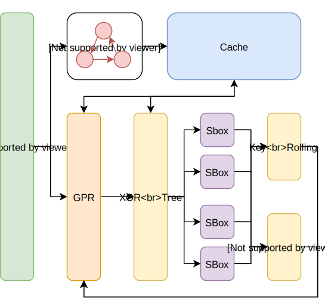
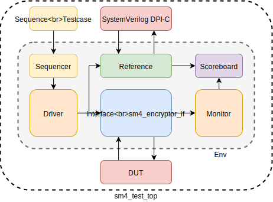

<style>
    h1{
        text-align:center
    }
    h2 {
        text-align:center
    }
    h3{
        text-align:center;
    }
    li {
        font-size: 18px;
    }
    p{
        font-size: 18px;
    }
    @media print {
        @page {
            margin: 0.75in
        }
    }
</style>
<section>

<h1>“复微杯” 2019上海大学生<br>电子设计大赛</h1>

## 数字赛道_安全
<br>
<p style="text-align:center; font-size: 35px"> SM4加密算法的数字电路实现</p>
<br>
<br>
<div style="text-align:center"></div>
<br>
<br>
<br>
<br>
<div style="text-align:center;font-size: 20px">
    学校（院）： 复旦大学微电子学院&emsp;
    <br>
    专业： 微电子科学与工程&emsp;&emsp;&emsp;&emsp;&emsp;
    <br>
    队伍名称：心情熊&emsp;&emsp;&emsp;&emsp;&emsp;&emsp;&emsp;&emsp;
    <br>
    队伍编号：&emsp;&emsp;&emsp;&emsp;&emsp;&emsp;&emsp;&emsp;&emsp;&emsp;&emsp;
    <br>
    &emsp;参赛队员：秦心宇&emsp;熊亚&emsp;林山青&emsp;&emsp;
    <br>
    指导老师：&emsp;&emsp;&emsp;&emsp;&emsp;&emsp;&emsp;&emsp;&emsp;&emsp;&emsp;
    <br>
    完成日期：2019-09-30&emsp;&emsp;&emsp;&emsp;&emsp;&emsp;
</div>
<p style="page-break-before: always">
</section>
<section>
<h3>参赛须知与承诺</h3>
<ol>
<li>参赛者必须保证参赛作品为首次参赛的原创作品，参赛作品不存在权利争议或侵犯第三方知识产权的行为，违反者自行承担相应责任。</li>
<li>参赛作品有下列情形，主办单位将取消该队伍的参赛资格或追回原授予的荣誉及奖励：经人检举或告发为他人代劳或违反本竞赛相关规定，有具体事实者并经查证属实者；经人检举或告发，涉及著作权、专利权等侵害，且侵权行为一旦经法院判决属实。</li>
<li>参赛作品的专利权、著作权等知识产权均归属该参赛队伍所有，但主办单位享有以原作者名义发表该项作品的权利，参赛队伍需全程参与由主办单位所举办的学术及推广教育活动。</li>
<li>参加队伍应尊重大赛评审委员会的决议，除非能具体证明其他作品违反本办法相 关规定，不得有其他异议。</li>
<li>大赛阶段缴交所有文件将不退回，请参赛队伍自行备份。</li>
</ol>
<div style="text-align: right;">
承诺人： （请全体团队成员签名） <br>
<br>
<br>
&emsp;&emsp;年&emsp;&emsp;月&emsp;&emsp;日
</div>
<p style="page-break-before: always">
</section>

### 摘要

SM4作为国家规定的加密算法，在无线局域网的领域中取得了广泛的应用。但在许多嵌入式软件中，SM4的是通过通用处理器执行代码实现的。为了提高加密效率，释放通用处理器的负载，我们基于安全性，面积和性能三方面的权衡，设计了SM4加密/解密的专用加速器。

相对于传统的设计，我们的设计分别在安全性，面积和性能三方面进行了优化。

安全性上，我们设计了动态随机掩码，用于周期性的刷新S盒的数据，有效防范了DPA拦截密钥。同时，我们还采用了用于对称互补的冗余的硬件，进一步缩小密钥在加密不同的明文时的功耗差距。

面积上，我们抛弃了传统查表的方法。通过自行推导S盒的表达式，我们使用纯组合逻辑实现了S盒。经过Design Compiler综合后，在65nm的TSMC的工艺下，纯组合逻辑相比查找表缩小了40%的面积。

性能上，我们借鉴了硬件路由器中通常使用一个Cache维护路由表的设计，在加速器中加入了一个用于存储轮密钥的Cache. 当加速器使用相同的密钥进行加密/解密时，就不需要反复求解密钥产生的轮密钥，因而可以提高效率。

为了使得加速器具有更好的通用性，我们将其包装成了AXI4-Lite总线，并以Xilinx Zynq 7000系列的FPGA作为测试平台评估其性能。我们还建立了UVM平台的方案，并给出了预期的测试覆盖率。

**关键字：SM4加密算法 S盒 侧信道攻击 能量分析攻击 加密加速器**

<p style="page-break-before: always">

### 团队介绍

“心情熊”团队共有三位2016级本科生组成，均来自复旦大学微电子学院。

秦心宇：负责SBox优化与UVM平台搭建
熊&emsp;亚：负责SCA防范的硬件设计与硬件优化
林山青：负责硬件的实现与FPGA平台的测试

### 方案介绍


#### 抵抗SCA攻击

现代侧信道攻击基本上借助的是能量差异。对于同一个密钥来说，其加密相同的数据必定会产生相同的能量谱，然后通过猜测和比对验证编不下去了密钥。SM4加密过程中，最容易被猜测的运算则是Sbox.
(这部分由熊亚来写吧，我好像编不下去了)

#### 面积优化

SM4核心的加密算法是进行非线性变换的SBox。通常实现SBox的思路是利用查找表，但首先每一次轮变化就需要4个Sbox,每个SBox的容量为256Byte.因而仅仅SBox就需要1kByte的空间。如果希望提高性能，即每一个周期进行多轮变化，这个空间还要更大。显然，这不是一种面向面积优化的好方案。

在参考了论文[1]后，我们发现SBox进行变换的表达式为：

$$
\textrm{SBox}(x) = A \cdot I(Ax + C) + C
$$

其中$x, A, C \in GF(2^8)$。论文[1]同样也给出了$A$和$C$的值：

$$
A = 
\left(
\begin{matrix}
    1 & 1 & 1 & 0 & 0 & 1 & 0 & 1 \\
    1 & 1 & 1 & 1 & 0 & 0 & 1 & 0 \\
    0 & 1 & 1 & 1 & 1 & 0 & 0 & 1 \\
    1 & 0 & 1 & 1 & 1 & 1 & 0 & 0 \\
    0 & 1 & 0 & 1 & 1 & 1 & 1 & 0 \\
    0 & 0 & 1 & 0 & 1 & 1 & 1 & 1 \\
    1 & 0 & 0 & 1 & 0 & 1 & 1 & 1 \\
    1 & 1 & 0 & 0 & 1 & 0 & 1 & 1 \\
\end{matrix}
\right)
\textrm{   } C = (
    \begin{matrix}
    1 & 1 & 0 & 1 & 0 & 0 & 1 & 1 
    \end{matrix}
)
$$

接下来我们可以建立多项式集合和$GF(2^8)$之间的映射，即每一个向量$x$都可以看成一个多项式，例如：
$$
x = (a_7 a_6 a_5 a_4 a_3 a_2 a_1 a_0) \rightarrow \sum_{i=0}^{7} a_ix^i
$$

运算$I$则代表的是乘法逆。在集合$GF(2^8)$上求解关于不可约多项式的逆。即定义：
$$
I(x) \cdot x = 1 \mod{f(x)}
$$

其中不可约多项式为：

$$
f(x) = x^8 +x^7 + x^6 + x^5 + x^4 + x^2 + 1
$$

运算$I(x)$的求解过程需要迭代，因而不适合用硬件实现。一个直观的思路是将其分解到$GF(2^2)$集合上的I(x)运算，并使用查找表（$GF(2^2)$集合上的乘法逆只有4个表项）进行运算。这里不将其数学过程展开，需要可以参考附录。

借助这些手段，我们可以用组合逻辑直接实现SBox. 详细的硬件信息请在数字模块实现方案中查看。下表是查找表实现的SBox和组合逻辑实现的SBox在TSMC 65nm工艺下综合后的面积信息。

(补全)

#### Cache与性能

SM4的用途非常广，其中一个很重要的用途就是用于无线局域网的信息加密。而无线局域网本身可能会存在多机通讯的问题，因而同一个设备同时处理多个密钥进行加密是非常常见的情况。

SM4的加密解密直接依赖的是轮密钥，而轮密钥是密钥唯一确定的，并且与加密/解密相同的是，轮密钥通常需要32次迭代才能求解完成。这对整个加密过程来说是一个不小的代价，特别是上一段中提及的多机通讯。因而为了提升性能，我们用一个Cache存储最近4次加密产生的轮密钥，并且每次进行加密之前去进行读取，如果命中，则直接从其中读出轮密钥进行加密/解密；否则再进行轮密钥的求解。由于轮密钥复用是一个相对广泛的情况，Cache的使用可以很大程度上提高性能。

目前加速器中的Cache的容量为4个密钥，使用LRU的替换策略。

#### 软件与硬件

SM4是一种分组加密算法，这也意味着长度超过128bit的明文需要进行分组。常见的分组有ECB和CBC. 我们在软件上实现了ECB和CBC的分组，因为软件的灵活性相比硬件更具有优势。

为了方便嵌入式设备的使用，我们设计的加速器具有AXI4-Lite接口，因而可以很方便的挂载在ARM处理器的总线上。为了方便使用，我们还用C语言编写了驱动。

### 数字模块实现方案

#### 总体模块

下图表示了我们设计的加速器的整体模块框图：

<div style="text-align:center"></div>

系统对外的接口是AXI4-Lite,由于是一种通用的接口，这里不对其进行介绍，只说明可以通过AXI配置的寄存器:
地址范围|读意义|写意义
-|-|-|-
0x00-0x03|获取上一次的明文/密文|设置明文/密文
0x04-0x07|获取上一次加密的密钥|设置密钥
0x08-0x0B|获取最近一次加密/解密的结果|无
0xC|最近的操作是否完成|开始一次加密/解密
0xD|无|指定操作为加密/解密。1为解密，0为加密
0xE|无|清除Cache
0xF|无|设置用于掩码的随机数


#### SBox

#### AXI4-Lite 接口模块

AXI4-Lite模块主要是由Xilinx官方生成的，因而程序可以很容易的打包成IP核，供ZYNQ系列的FPGA验证和使用。

AXI4接口定义文件可以参考driver/AXI_SM4的两个SV文件。

#### SM4算法模块

在去掉AXI接口模块后，顶层模块`sm4_encryptor`的I/O口如下：

名称|位宽|方向|意义
-|-|-|-
clk_i|1|输入|时钟
reset_i|1|输入|高电平有效同步复位信号
content_i|128|输入|明文/密文
key_i|128|输入|密钥
encode_or_decode_i|输入|当前操作是否是解密
v_i|1|输入|输入是否为valid信号
ready_o|1|输出|加速器是否空闲
crypt_o|128|输出|加密/解密的结果
yumi_i|1|输入|结果是否已经被外部寄存器取走
invalid_cache_i|1|输入|使Cache中内容失效

SM4算法执行模块包括数据运算通路（即轮密钥产生模块），Cache和状态机组成。其中状态机主要是用于控制迭代次数，并执行需要的功能：

```verilog
    typedef enum logic [3:0] {eIdle, eCheckKey, eEvaKey, 
        eLoadCrypt, eCrypt, eReverse, eDone} state_e;
```
其各个状态的含义如下表所示：

状态名|状态含义
-|-
eIdle|加速器当前处于空闲状态，等待外部输入。v_i=1时跳转到eCheckKey.
eCheckKey|加速器当前阶段检查密钥是否已经存储在Cache中。如果Cache命中，则跳转到eLoadCrypt阶段，否则进入eEvaKey开始求解密钥。
eEvaKey| 32次迭代求解32个轮密钥的过程。求解的结果会写回到Cache中。
eLoadCrypt| 把明文/密文读入到加速器的通用寄存器中，准备开始加密/解密。
eCrypt|32次迭代进行加密/解密。
eReverse|翻转4个字的顺序
eDone| 操作完成，如果yumi此时为1,那么跳转到eIdle阶段，否则继续保持在eDone阶段。

#### Cache

Cache的主要作用是用于存储最近密钥的轮密钥。其系统框图如下所示：

<div style="text-align:center"></div>

我们根据实际情况对通用Cache的行为进行了修改，主要有两处：

* Cache的读取流程。传统的Cache是需要同时给出地址才能读写。在SM4的一轮加密中，如果没有异常情况，使用的密钥是同一个，重复传递密钥可能会造成总线带宽的浪费。因而我们Cache采取激活的策略，即在读取之前首先将密钥送入Cache中进行激活，之后如果不重新激活新的密钥，那么后续读取的轮密钥全都是当前密钥产生的。密钥的激活可以在检查Cache是否命中时进行。
* Cache的带宽。由于我们设计的加密流程是32次迭代，而每次迭代只需要读取一个轮密钥即可，因而读取的时候还需要外部提供地址。这个地址恰好可以利用记录迭代次数的计数器。

Cache使用LRU策略进行替换，为了缩短关键路径，LRU的实现采用矩阵法。

Cache对应的模块`key_cache`的I/O口如下：

名称|位宽|方向|意义
-|-|-|-
clk_i|1|输入|时钟
reset_i|1|输入|高电平有效同步复位信号
key_i|128|输入|用于查找轮密钥的密钥
v_key_i|1|输入|密钥的输入是否有效
is_missed_o|1|输出|当前查找的密钥是否未命中
idx_r_i|5|输入|需要读取的轮密钥的地址（0-31）
v_r_i|1|输入|轮密钥读取地址是否有效
w_i|32|输入|需要写入轮密钥的值
idx_w_i|5|输入|需要写入轮密钥的地址（0-31）
v_w_i|1|输入|写入是否有效
tkey_o|32|输出|读轮密钥得到的结果
invalid_i|1|输入|是否清空Cache

#### 轮变换模块

从根本上讲，轮密钥的产生和加密/解密的过程都是使用类似的轮函数，但二者的区别是循环移位的量不同。模块`turn_transform`的作用就是执行每一次轮变换。

`turn_transform`主要由三部分组成：

1. 异或树，用于计算多个32位操作数之间的异或，并使用平衡二叉树的结构尽可能的缩小延迟。
2. SBox,已经在前面的章节详细探讨过了。
3. 循环移位器。

由于我们已经实现了每一次迭代的硬件，因而如果希望提高性能，在一个周期内进行多次迭代，那么也是非常容易的。

`turn_transform`的I/O口如下：

名称|位宽|方向|意义
-|-|-|-
i|128|输入|需要进行迭代的密钥/明文或者已经进行若干次迭代的中间结果。
is_key_i|1|输入|当前迭代的是否为密钥
rkey_i|32|输入|用于加密的轮密钥，如果迭代的是密钥，那么则是轮常数
o|32|输出|当前迭代的结果
testing_clk_i|1|输入|用于打印调试信息的测试时钟

#### 辅助性模块

其他的辅助性模块包括实现LRU的模块`lru_recorder`，用于选择被替换的元素，其I/O口的分布如下：

名称|位宽|方向|意义
-|-|-|-
clk_i|1|输入|时钟
reset_i|1|输入|高电平有效的同步复位信号
access[1/2]_1|2|输入|访问的表项
v[1/2]_i|1|输入|访问是否有效
replace_which_o|2|输出|哪一项为替换项

`priority_encoder`是一个4位优先编码器，主要被用在了Cache和LRU的实现逻辑中，其内部的实现本质上是一个case语句。其I/O口定义如下：

名称|位宽|方向|意义
-|-|-|-
i|4|输入|被编码信号（单活跃态）
o|2|输出|编码输出

`roll_shifter`是用户可以自定义的用于进行循环移位的硬件。其I/O口和参数定义如下：

名称|位宽|方向|意义
-|-|-|-
i| width_p | 输入 | 操作数
o| width_p | 输出 | 结果

`xor_tree`则是用于多个操作数异或的平衡二叉树。如果要异或的个数不为$2^N$，那么剩余的位置用0补齐。其I/O口的定义如下：

名称|位宽|方向|意义
-|-|-|-
i| width_p | 输入 | 操作数
o| width_p | 输出 | 结果

### 验证方案

由于我们的设计中不仅有硬件代码，还有软件代码，因而我们设计了两个相对独立的验证方案。

- 数字硬件正确性的验证，包括SM4的加密/解密结果，迭代周期数，Cache的替换策略等。这部分验证交给UVM去完成。
- 软件+FPGA级别的验证，包括基于Xilinx ZYNQ系列开发板的验证和标准结果的比对。

#### Testplan

此处详细介绍所有的功能验证方案，包括软件和硬件。

在硬件上验证系统功能主要基于`sm4_encryptor`模块，主要需要验证的方案有：
- 加密/解密结果的正确性， 包括
    - 每一次迭代结果的取值
    - 抵抗侧信道攻击而引入的带有随机Maks信息的结果
- 状态机的正确性，包括
    - 完成一次加密/解密所需要周期数是否符合预期
    - 状态机是否正确跳转，包括eIdle->eCheckKey, eCheckKey->eEvaKey, eCheckKey->eLoadCrypt和eReverse->eDone四个状态。
- Cache的正确性，包括：
    - Cache的读写是否有效
    - Cache的LRU替换策略是否有效
- SBox的正确性，包括：
    - SBox的输出值是否符合预期
    - 经过冗余后的SBox的输出的Hamming Weight是否接近16.（总数为32）

软件方面，主要的测试方面为：
- AXI总线的正确配置，软件层与硬件层的联合操作是否符合预期
- ECB/CBC函数的正确性

附件Testplan.xls文件提供了硬件详细的计划说明。

#### UVM 整体平台

下图描述了我们顶层UVM平台的整体框图：

<div style="text-align:center"></div>

顶层平台上有两个Environment, 其分别对应不同的Scoreboard, 一个用于检测正确性，另外一个则用于检测Cycle的数目，以验证是否符合周期。

下表列出了用于检测正确性的Environment中的Agent。

Agent序号|测试目标|Sequence Item|Monitor
-|-|-|-


#### 软件验证/仿真

首先，我们使用Vivado搭建基于Zynq 7000系列FPGA的测试平台，并使用框图构建以下系统：

<div style="text-align:center"></div>

其中AXI_SM4为我们代码包装好的IP核，AXI Timer则是用于统计时间的计时器。接下来我们进行综合，并将硬件导出到Xilinx SDK中。随后创立C程序加载我们编写的驱动，然后编写第一个程序用于检测软硬件是否协同工作：

```c
#include <stdio.h>
#include "platform.h"
// This file is written by ourselves.
// You may find it in driver/sm4_encryptor.h
#include "sm4_encryptor.h"

int main(){
    init_platform();
    // Specify the base address of SM4 Accelerator.
    volatile void *sm4_base = 0x43C00000;
    // Generate Testing Key.
    struct QWord content = {0x1234567, 0x89ABCDEF, 0xFEDCBA98, 0x76543210};
    struct QWord key = {0x1234567, 0x89ABCDEF, 0xFEDCBA98, 0x76543210};
    // Do encrypting.
    struct QWord res = encrypt(sm4_base, content, key, 0);
    // Output result
    printf("Encrypt:\n");

    for(int i = 0; i < 4; ++i){
    	printf("%x\n", res.value[i]);
    }
    // Do decrypting.
    printf("Decrypt:\n");

    struct QWord back_res = encrypt(sm4_base, res, key, 1);
    // Output result
    for(int i = 0; i < 4; ++i){
    	printf("%x\n", back_res.value[i]);
    }

    cleanup_platform();
    return 0;
}
```

下图为SDK Terminal给出的输出，可以看到，SM4的加密和解密算法执行下来是完全正确的：

<div style="text-align:center"></div>

同时我们还统计了加密/解密的时间用于检测是否有Cache命中的情况。分别执行在第二次加密之前执行/不执行清除Cache的功能，得到的时间是完全不一样的：

```c
    struct QWord back_res = encrypt(sm4_base, res, key, 1);

    printf("Decryption result is:\n");
    for(int i = 0; i < 4; ++i){
    	printf("%x\n", back_res.value[i]);
    }

    invalid_cache(sm4_base); // Clean Cache.

    struct QWord back_res_2 = encrypt(sm4_base, res, key, 1);

    printf("Decryption result is:\n");
    for(int i = 0; i < 4; ++i){
        printf("%x\n", back_res_2.value[i]);
    }
```

其结果如下图所示：


<div style="text-align:center"></div>

可见二者之间的差距大约为32个周期。

随后我们测试了ECB和CBC两种不同加密方式的正确性。这里以CBC为例说明，其代码如下所示：

```c
    struct QWord content[3] = {
        {0x1234567, 0x89ABCDEF, 0xFEDCBA98, 0x76543210},
        {0x1234567, 0x89ABCDEF, 0xFEDCBA98, 0x76543210},
        {0x1234567, 0x89ABCDEF, 0xFEDCBA98, 0}
    };
    struct QWord key = {0x1234567, 0x89ABCDEF, 0xFEDCBA98, 0x76543210};

    struct QWord res = encrypt(sm4_base, content[0], key, 0);

    for(int i = 0; i < 4; ++i){
    	printf("%x\n", res.value[i]);
    }

    printf("\n");

    struct QWord initial = {0, 0, 0, 0};

    struct QWord back_res[3] = {0};
    int size = cbc_encrypt(sm4_base, (char *)(&content), 44, 
        key, initial, (char *)(&back_res), 0);

    for(int j = 0; j < 3; ++j){
        for(int i = 0; i < 4; ++i){
            printf("%x ", back_res[j].value[i]);
        }
        printf("\n");
    }
        

    printf("\n");

    int size2 = cbc_encrypt(sm4_base, (char *)(&back_res), 48,
         key, initial, (char *)(&content), 1);

    for(int j = 0; j < 3; ++j){
        for(int i = 0; i < 4; ++i){
            printf("%x ", content[j].value[i]);
        }
        printf("\n");
    }
```

其输出如下图所示：

<div style="text-align:center"></div>

可知第二个Block进行加密前的明文为：[0x693d9a53, 0x5bad5bb1, 0x786f53d7, 0x253a7056], 而使用C++编写的验证出来的结果为：

<div style="text-align:center"></div>

第三组结果也是可以对应上的，也可以看到程序确实成功实现了解密。更为基础的ECB算法的验证过程同理，这里就不给出详细过程了。

### 总结

### 参考文献